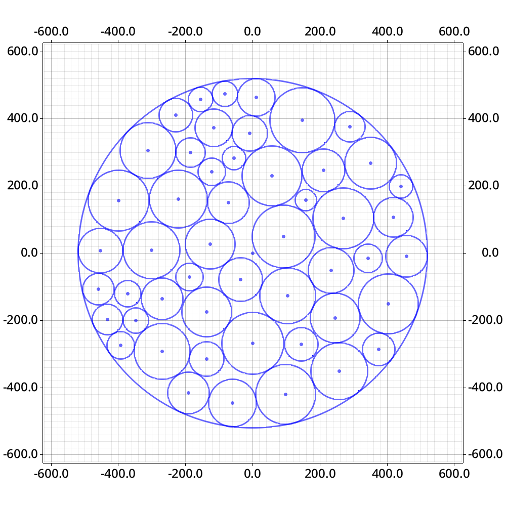

# Code for science research work

> [!IMPORTANT]  
> This is my bachelor's thesis code for "PROBLEM OF OPTIMAL PACKING OF UNEVEN CIRCLES AND APPROACHES TO ITS SOLUTION."  

## Condition

A set of small circles needed to be packed into a circle and placed in $(0, 0)$ so that any circles would not overlap and would be inside the main (the biggest) circle. The program finds one of the local minima of the problem of packing circles into a circle of the minimum radius.

$$
\begin{cases}
  (x_i-x_j)^2 + (y_i-y_j)^2 \ge (r_i+r_j)^2, &&\forall i,j (i \ne j) \\
  x_i^2+y_i^2 \le (R - r_i)^2, &&\forall i \\
\end{cases}
$$

$$
R \to \min
$$

Where $(x_i, y_i)$ is the coordinate of the given circle's center, $r_i$ - radius (same for $j$), $R$ - radius of the main circle.

## Code usage

There are several different strategies for finding local answers:
- `heuristic algorithm` 
- `heuristic algorithm` + `r-algorithm`
- `start point random generation` + `r-algorithm`

A big part of the code has been used to evaluate test sets (`input folder`) and compare them with existing results (`output folder`). To run code for some cases - check out codes in the `evaluate` folder. 

> [!NOTE]
> no `input` and `output` folders in the repository. Check the code in the `evaluate` folder to know the structure of input and output files.

## Example of results

  

